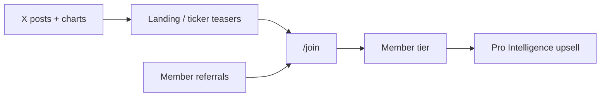

# PortFuel marketing & growth plan

A practical campaign plan for acquiring members, with **X (Twitter) as the primary organic engine** and automation where it protects paid value and stays compliant.

**Related:** [X-SOCIAL.md](./X-SOCIAL.md) (what’s built today) · [LAUNCH-PLAYBOOK.md](./LAUNCH-PLAYBOOK.md) (making the product feel alive) · [BACKLOG.md](./BACKLOG.md) (deferred build items)

---

## 1. Goals & positioning

### What we’re selling

PortFuel is **curated community intelligence**: attributed calls on real charts, reputation (rankings), a separate **Fueled desk** lane, and **Pro Intelligence** research tools—not “hot tips before they move.”

### Marketing goals (90 days)

| Goal | Target | How we measure |
|------|--------|----------------|
| Qualified traffic | Steady week-over-week growth | UTM clicks from X → `/join`, `/ticker/*` |
| Signups | Founding cohort + steady Member conversions | Stripe checkout starts, `referral` attribution |
| Proof | Weekly “wins” content without leaking edge | Posts only after performance gates; member opt-in |
| Retention story | Members see their wins celebrated | Opt-in spotlight + in-app notifications |

### Funnel



**Rule:** Public surfaces (landing, X, ads) show **outcomes and structure**, not **fresh entries**. Paid members get timing, full feed, new calls, and Pro intel.

---

## 2. Content principles (non‑negotiable)

1. **No early member calls on X** — only calls that pass strict “winner” gates (see §4).
2. **No guaranteed returns** — use “member call,” “since entry,” “on PortFuel”; always end with disclaimer (already in templates).
3. **Attribution** — @username or display name + link to ticker/call; never anonymous flexing.
4. **Opt-in for member UGC** — profile setting + per-call confirmation before first public post.
5. **Quote-tweet updates** — follow-ups quote the original PortFuel post, not a new standalone thread (keeps narrative and avoids spam).
6. **UTM on every link** — `utm_source=x&utm_medium=social&utm_campaign={type}` (already used in `x-compose`).
7. **Rate limit** — aim **3–5 posts/week** on the brand account until engagement data exists; quality over volume.

---

## 3. What we post on X — content pillars

### Pillar A — Proof (automated, highest priority)

**Purpose:** Social proof that the community and desk produce real tracked outcomes.

| Post type | Audience | When | Asset | Status |
|-----------|----------|------|-------|--------|
| **Member win spotlight** | Opted-in members | After performance gate | Chart PNG + thesis excerpt + link | **Planned** (§6) |
| **Member win update** | Same call | +25%, target hit, new high since last post | Quote tweet + optional chart | **Planned** |
| **Fueled milestone** | Desk | +10%, +25%, target reached | Chart PNG | **Shipped** (`fueled_milestone`, cron/autopost) |
| **Weekly leaderboard** | Community | Monday cron | Text + `/rankings` link | **Shipped** |

**Shipped defaults (env-tunable):** **≥20% return after 48 hours**, or **≥30% after 36 hours** (exceptional outcomes). After qualifying, a **48-hour review window** runs before any X post — no same-day pumps, institutional tone. Homepage teasers stay at +5% / +10%+7d; X is stricter than the landing page. Copy and charts use “Member call on record” / “since publication” branding.

### Pillar B — House / brand (semi-automated)

**Purpose:** Show that PortFuel has a serious research lane, not only crowd calls.

| Post type | When | Asset | Status |
|-----------|------|-------|--------|
| **New Fueled desk call** | On publish (optional) or weekly digest | Text + ticker link; thesis truncated in template | **Shipped** (off by default: `X_AUTOPOST_FUELED_ON_PUBLISH`) |
| **Desk weekly note** | You publish note | 1–2 sentences + link to desk | Manual → automate later |
| **“How PortFuel works”** | Evergreen, monthly | Static carousel or short screen recording | Manual |

**Recommendation:** Keep **Fueled publish autopost off** until you have a rhythm; use **milestones + weekly leaderboard** for desk proof instead of broadcasting every new entry.

### Pillar C — Education & culture (mostly manual)

**Purpose:** Explain the product; attract traders who care about track records.

Examples (no automation v1):

- “What’s a call on PortFuel?” (entry / target / stop on chart)
- Screenshot of rankings + trusted badge
- “Members called `$XYZ` before the move” — **only if** the call already passed the public win gate
- Poll: “Do you track your own calls?” → CTA join

### Pillar D — Launch & offers (manual, time-boxed)

- Founding member invites (DM/email first, then public)
- Referral shoutouts (“Join with my link” — member-driven, not brand spam)
- Voucher / trial campaigns (see [VOUCHERS.md](./VOUCHERS.md))

---

## 4. Member win sharing — product rules

This is the core of your idea: **celebrate winners, never give away the edge.**

### 4.1 User settings (to build)

| Setting | Default | Meaning |
|---------|---------|---------|
| `allow_social_highlight` | `false` | Master opt-in: PortFuel may feature my winning calls on X |
| `social_highlight_show_thesis` | `true` | Include full thesis text (truncated for 280 chars) vs headline-only |
| `social_highlight_show_username` | `true` | Use @username in post; if false, first name / display name only |

**UX:** Profile → Privacy & sharing + optional prompt when a call first crosses the win gate: “This call qualifies for a PortFuel spotlight on X. Allow?”

### 4.2 Eligibility (first public post)

A member call becomes **eligible** when **all** are true:

- `allow_social_highlight = true` (or user approves one-time for this call)
- `return_pct >= 10` (configurable env: `X_MEMBER_WIN_MIN_RETURN_PCT`)
- `called_at <= now() - 7 days` (configurable: `X_MEMBER_WIN_MIN_AGE_DAYS`) — matches `teaser_public_proven`
- `subscription_status = active`
- Not on symbol blocklist (admin list for compliance/sensitivity)
- Not already posted (`social_post_log.post_type = 'member_win'`, `ref_id = call.id`)

**Never post:** calls with return &lt; threshold, calls younger than min age, or “just published” calls—even if they’re up 50% intraday.

### 4.3 First post format

**Text template (example):**

```
Member win · $SYMBOL LONG
+18.2% since call · @member
Thesis: {excerpt or full if short}
Chart + full thesis (members): {link}
Not investment advice.
```

**Media:** Reuse social chart pipeline (`/api/social/chart/{callId}`) — extend markers for **member** calls (today optimized for Fueled). Show entry marker, direction, return %, PortFuel logo.

**Link:** `/ticker/{symbol}?utm_campaign=member_win` — thesis detail **gated** on site (landing already blurs teasers; logged-out users see performance card, not full thesis unless you choose to show excerpt only on X).

### 4.4 Updates (quote tweets)

When a call **already has** `social_post_log.tweet_id` for `member_win`:

| Trigger | Action |
|---------|--------|
| New milestone (+25%, target reached) | Quote tweet original; short text + optional new chart |
| Return improved ≥5 pts since last public update | Optional “still running” quote (max 1 per 14 days per call) |

Store `parent_tweet_id` on log row; use X API `quote_tweet_id` when posting.

**Do not** repost the full thesis on every tick up—only meaningful milestones (same philosophy as Fueled milestones).

### 4.5 What members get

- Credit and brand exposure (if they want it)
- Referral link in bio → their `referral_code` (optional line in template: “Track your calls on PortFuel”)
- **Not** early access for followers—the link sells **membership**, not the trade

---

## 5. Automation architecture

### Already shipped

| Piece | Location |
|-------|----------|
| X post compose + 280 trim | `src/lib/social/x-compose.ts` |
| Chart PNG 1200×675 | `src/lib/charts/social-chart-*.ts`, `/api/social/chart/[callId]` |
| Post log + idempotency | `social_post_log`, `src/lib/social/post-log.ts` |
| Milestone detection | `src/lib/notifications/milestones.ts` (Fueled only in compose) |
| Cron batch | `/api/cron/x-social` |
| Admin preview/post | Admin → Social |
| Editable templates | `social_post_copy` table |
| Public homepage gates | `teaser_public_performing` (+5% / 30d), `teaser_public_proven` (+10% / 7d) |

### Build phases

#### Phase 1 — Member win posts (MVP)

- [ ] Migration: `users.allow_social_highlight`, `social_highlight_show_thesis`, `social_highlight_show_username`
- [ ] Migration: extend `social_post_log` — `tweet_id`, `parent_tweet_id`, `post_type` enum add `member_win`, `member_win_update`
- [ ] `composeMemberWinPost(callId)` + chart payload for non-Fueled calls
- [ ] Cron job after quote refresh: scan eligible calls → queue posts (respect dry run)
- [ ] Admin: preview member win posts; force post; blocklist symbols
- [ ] Env: `X_POST_MEMBER_WINS=true`, thresholds in env

#### Phase 2 — Quote-tweet updates

- [x] On milestone for calls with existing `member_win` tweet → `composeMemberWinUpdate` + quote API
- [x] Separate idempotency ref: `member_win_update-{callId}-{milestone}`

#### Phase 3 — Smarter scheduling & digest

- [x] Weekly “3 wins this week” composite image + recap tweet (`weekly_digest`, Admin → Social)
- [x] Admin X copy editor for member spotlight, updates, weekly digest (`AdminSocialCopyPanel`)
- [x] Admin activity log + publish queue (`AdminSocialActivityPanel`)
- [ ] A/B copy variants in `social_post_copy`

#### Phase 4 — Inbound loop (partially shipped)

- [ ] Continue **X → desk draft** for Fueled curation (Admin → Social inbound)
- [ ] Do **not** auto-scrape competitor accounts

---

## 6. Weekly posting calendar (recommended)

| Day | Post | Automation |
|-----|------|------------|
| **Mon** | Leaderboard top 3 | Cron `x-social` |
| **Tue** | — or manual culture post | — |
| **Wed** | Member win #1 (if eligible) | Cron member wins |
| **Thu** | Fueled milestone (if any fired) | Quote refresh → milestones |
| **Fri** | Member win #2 or desk note | Cron / manual |
| **Sat** | — | — |
| **Sun** | Optional “week in review” text | Manual until Phase 3 |

Cap: **max 5 automated + 1–2 manual** per week.

---

## 7. Visual & creative guidelines

### Chart images (automated — primary asset)

- **Size:** 1200×675 (X timeline friendly)
- **Style:** Dark PortFuel chrome, candles, entry marker, direction arrow, return badge
- **Logo:** `public/logo-light.png`
- **Preview:** `/api/social/chart/{callId}?milestone=return_10&format=png`

### Static / brand images to create (manual or Figma)

| Asset | Use |
|-------|-----|
| **Product hero** | Landing, Meta/Twitter ads — chart + call card mock |
| **“How it works” 3-panel** | Pin post, ads — Submit → Track → Rank |
| **Pricing card** | Member vs Pro comparison screenshot |
| **Rankings snapshot** | Social proof — top 3 blurred thesis / full for members ad |
| **Founding member badge** | Limited-time join creative |
| **Empty vs alive** | Before/after feed (use preview mode for screenshot only) |

### Video (optional, high leverage)

- 30s screen recording: submit call → appears on ticker chart
- 60s: Fueled desk + member win on rankings

### Copy tone

- Confident, factual, **not** hype (“10x”, “guaranteed”)
- Prefer “member call · +18% since entry” over “we called the bottom”

---

## 8. Other acquisition channels

### 8.1 Referrals (shipped — activate in campaigns)

- Every member gets `referral_code`; attribute on join/voucher redeem
- **Campaign:** “Spotlight post tags your handle — bring friends with your link”
- Track: conversions per referrer in admin/analytics

### 8.2 Paid advertising (test with small budget)

| Channel | Fit | Suggested test |
|---------|-----|----------------|
| **X/Twitter ads** | High | Promote best **chart image** post (member win or milestone), landing `/join`, lookalike finance interests |
| **Meta (IG/FB)** | Medium | Carousel “track record” creative; older demographic |
| **Google Search** | Medium | Brand + “stock call tracker”, “investing community calls” |
| **Reddit** | Medium | r/stocks, r/options — **strict** sub rules; value posts, not ads |
| **Stocktwits / Discord** | Medium | Partnerships with small communities; offer founding slots |

**Budget starter:** $500–1k/month split 60% X, 25% retargeting (site visitors), 15% experiment.

**Landing alignment:** Ads must match gated product—use homepage **proven winners** section, not live feed.

### 8.3 SEO & content

- Ticker pages indexable (`/ticker/AAPL`) with title “AAPL · community calls · PortFuel”
- Future: `/blog` or `/learn` — “How to track your trading ideas” (captures search, links to join)

### 8.4 Partnerships

- FinTwit micro-influencers: free Pro month for honest review (disclosure required)
- Newsletter swaps (small finance Substacks)

### 8.5 Email (see [EMAIL.md](./EMAIL.md))

- Weekly digest: your calls + top community wins + desk note
- Re-engage dormant members with “your call hit +10%” (in-app + email)

### 8.6 Discord / community

- Optional PortFuel server for founding members—not required for launch if X + in-app feed suffice

---

## 9. Metrics & experiments

### North-star

- **Paid active members** (Stripe `subscription_status = active`)

### Channel metrics

| Metric | Tool |
|--------|------|
| X → site clicks | UTM in Vercel Analytics / Plausible |
| Join conversion | `/join` → checkout |
| Referral share | `user_referrals` table |
| Post performance | X analytics per post type; store `tweet_id` in log |

### Experiments (8–12 weeks)

1. Member win chart vs text-only post — click-through to `/join`
2. Thesis excerpt vs “see on PortFuel” tease only
3. Monday leaderboard vs Wednesday
4. Ad creative: milestone chart vs product hero

---

## 10. Compliance & risk checklist

- [ ] All templates include **“Not investment advice.”**
- [ ] Legal pages linked in bio and `/join`
- [ ] Member opt-in recorded (timestamp) before first X feature
- [ ] Admin symbol blocklist for sensitive names
- [ ] Dry run 1 week before live member posts
- [ ] No posting minors’ PII; usernames only with consent

---

## 11. 90-day rollout timeline

| Weeks | Focus |
|-------|--------|
| **1–2** | Dry-run X: milestones + leaderboard; 2 manual culture posts; founding invites |
| **3–4** | Ship member opt-in settings + admin preview; first **manual-approved** member win post |
| **5–6** | Automate member win cron (thresholds on); quote-tweet updates for 1–2 calls |
| **7–8** | Turn on small X ads pointing at best chart post; measure join CPA |
| **9–10** | Referral push in spotlights; email digest v1 |
| **11–12** | Review rates; add composite “week in review” image if data supports it |

---

## 12. Immediate next steps (engineering)

1. **Profile:** add social highlight toggles (§4.1).
2. **`social_post_log`:** store `tweet_id` for quote chains.
3. **`composeMemberWinPost` + chart** for non-Fueled calls.
4. **Cron:** `member_win` scanner after `refresh-quotes` (same hook as milestones).
5. **Admin:** preview queue “Eligible member wins” with Approve / Skip.
6. **Docs:** extend [X-SOCIAL.md](./X-SOCIAL.md) when Phase 1 ships.

---

## Summary

PortFuel’s marketing should **prove outcomes in public** while **selling timing and depth inside the paywall**. X automation already handles **Fueled milestones, leaderboard, and chart images**; the big unlock is **opt-in member win posts** with the same performance gates as the homepage, plus **quote-tweet follow-ups** for continued momentum. Pair that with referrals, light paid promotion of chart creatives, and a steady manual/education layer—and you have a full campaign without giving away early calls.
